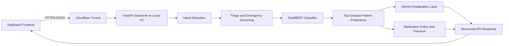

# AidFidelis AI Architecture Presentation

## 1. Project Overview

AidFidelis is a hybrid health-information system that combines:

- A deployed web frontend
- A FastAPI backend running on a local PC
- A fine-tuned DistilBERT disease-pattern classifier
- Gemini for controlled explanations
- A rule-based medication policy layer
- Firebase/Firestore for approved medication rules

The system provides general health information and symptom-pattern matching. It does not provide a confirmed medical diagnosis.

---

## 2. High-Level Architecture



The request flow is:

```text
Frontend
  -> Cloudflare HTTPS tunnel
  -> FastAPI backend on the local PC
  -> Intent detection
  -> Triage and emergency screening
  -> DistilBERT classification
  -> Gemini explanation
  -> Medication policy checks
  -> Structured response to frontend
```

---

## 3. Network and Hosting Architecture

The frontend is hosted separately from the AI model. The AI model runs on the local computer.

The local backend is started with:

```powershell
python -m uvicorn main:app --host 0.0.0.0 --port 8000
```

Cloudflare Tunnel exposes the local API through a public HTTPS URL:

```powershell
cloudflared tunnel --url http://127.0.0.1:8000
```

The deployed frontend cannot call `localhost`, because `localhost` in a browser refers to the visitor's computer. Instead, the frontend calls the public Cloudflare URL:

```text
https://your-tunnel.trycloudflare.com/api/symptom-check
```

The main API endpoints are:

```text
GET  /health
POST /api/symptom-check
POST /api/symptom-check/stream
```

The streaming endpoint uses Server-Sent Events, or SSE, to send progress messages and the final result.

---

## 4. CORS Protection

The backend uses FastAPI's CORS middleware to allow browser requests from approved frontend origins.

Allowed origins include:

```text
https://aidfidelis.web.app
http://localhost:5173
http://127.0.0.1:5173
```

CORS is required because the frontend and backend are hosted on different origins.

The browser first sends an `OPTIONS` preflight request. The backend must respond successfully before the browser sends the actual `POST` request.

A successful preflight response includes:

```text
Access-Control-Allow-Origin: https://aidfidelis.web.app
```

---

## 5. Request Schema

The frontend sends a JSON request containing:

```json
{
  "symptoms": "fever, headache and chills",
  "age": 30,
  "sex": "male",
  "duration": "3 days",
  "previous_answers": [],
  "contraindication_screen_complet": false
}
```

The backend validates the request using Pydantic.

The frontend currently uses the field:

```text
contraindication_screen_complet
```

The backend accepts this spelling and maps it internally to:

```text
contraindication_screen_complete
```

This prevents a spelling difference from causing a `422 Unprocessable Content` error.

---

## 6. Intent Detection

Before running the disease model, the system determines what the user is trying to say.

Examples:

```text
"Hey"
```

is treated as a greeting.

```text
"I feel unwell"
```

is treated as a vague health report.

```text
"I have fever and headache"
```

is treated as a health report.

This prevents greetings and casual messages from being sent unnecessarily to the disease classifier.

The intent detection logic is implemented in:

```text
symptom_disease_model/symptom_checker.py
```

---

## 7. Triage and Emergency Screening

The system performs a triage step before classification.

Triage checks:

- Whether enough information is available
- Whether follow-up questions are required
- Whether an emergency warning sign is present

Examples of emergency warning signs include:

- Severe chest pain
- Difficulty breathing
- Loss of consciousness
- Seizures
- Severe confusion
- Severe bleeding

If an emergency warning sign is found, the system returns an urgent-care response instead of continuing with ordinary disease classification.

This is a safety layer. The classifier is not intended to replace emergency medical care.

---

## 8. Preparing Text for the Model

The system builds two versions of the user's information.

### Full context

This is used by Gemini and may contain both positive and negative findings:

```text
fever, headache and chills.
Duration: 3 days.
Follow-up answers: no chest pain
```

### Classifier input

This is optimized for the disease classifier:

```text
fever, headache and chills.
Symptoms have lasted 3 days
```

Negative findings are generally removed from the classifier input because many symptom text classifiers may still react to a symptom word inside a phrase such as:

```text
No fever
```

The full context is preserved for the explanation layer because negative findings can be clinically meaningful.

---

## 9. Classification Model

The disease model is based on:

```text
DistilBertForSequenceClassification
```

using the pretrained base architecture:

```text
distilbert-base-uncased
```

The model has:

- A WordPiece tokenizer
- A DistilBERT transformer encoder
- A neural classification head
- 1,082 disease-pattern output classes

The model configuration is stored in:

```text
original-model/config.json
```

The inference implementation is stored in:

```text
symptom_disease_model/inference.py
```

### Why DistilBERT?

DistilBERT is a smaller and faster version of BERT. It retains the transformer attention architecture while using fewer parameters, which makes it more practical to run on a local computer.

The transformer analyzes relationships between words instead of only counting keywords.

For example, it can learn differences between patterns such as:

```text
fever + chills + sweating
```

and:

```text
fever + rash + joint pain
```

---

## 10. Tokenization

The tokenizer converts natural language into numerical token IDs.

For example:

```text
I have fever and headache
```

is converted into tokens and then into IDs that the neural network can process.

The tokenizer also:

- Adds special tokens
- Truncates very long inputs
- Pads inputs when required

The transformer receives the resulting token IDs and attention mask.

---

## 11. Transformer Classification Process

The DistilBERT encoder transforms the token sequence into a contextual representation.

The classification head then produces one raw score, called a logit, for each of the 1,082 classes.

Conceptually:

$$
z = Wh + b
$$

where:

- $h$ is the representation generated by DistilBERT
- $W$ is the classification weight matrix
- $b$ is the classification bias
- $z$ contains the logits for all disease-pattern classes

The logits are converted into normalized scores using softmax:

$$
P(y=i \mid x) = \frac{e^{z_i}}{\sum_{j=1}^{N} e^{z_j}}
$$

where $N = 1082$.

The system ranks the classes by their scores and keeps the strongest predictions.

---

## 12. Classification Output

An example output may look like:

```text
Malaria                   99.72%
Dengue                     0.16%
Typhoid                    0.02%
```

Internally, this is represented approximately as:

```json
[
  {
    "disease": "Malaria",
    "confidence": 0.9972
  },
  {
    "disease": "Dengue",
    "confidence": 0.0016
  },
  {
    "disease": "Typhoid",
    "confidence": 0.0002
  }
]
```

The system normally returns the top three predictions to the rest of the workflow.

Important:

> These are model confidence scores, not confirmed medical probabilities.

The model performs classification of learned symptom patterns. It does not confirm a diagnosis.

---

## 13. Confidence Assessment

The backend compares the strongest score with the second strongest score.

The prediction margin is:

$$
\text{margin} = \text{top score} - \text{second score}
$$

The result is classified into levels such as:

```text
higher
uncertain
low
insufficient
```

A high top score with a large margin means the model found a stronger pattern match than the alternatives.

A small margin means multiple conditions produced similar scores, so the result should be treated cautiously.

The system does not interpret model confidence as medical certainty.

---

## 14. Gemini Explanation Layer

DistilBERT and Gemini have different responsibilities.

```text
DistilBERT = disease-pattern classification
Gemini = explanation and communication
```

Gemini receives:

- The user's symptom context
- The classifier's supplied predictions
- The classifier confidence scores

Gemini is instructed to:

- Explain the supplied predictions
- Use cautious language
- Avoid diagnosing the user
- Avoid adding conditions not returned by the classifier
- Avoid prescribing medication or dosage
- Identify warning signs
- Recommend professional evaluation where appropriate

The backend validates Gemini's structured JSON response and removes any condition that was not present in the classifier output.

This limits the explanation model from inventing new disease results.

---

## 15. Medication Policy Layer

Medication guidance is handled separately from Gemini.

The policy layer checks:

- Classifier confidence
- The prediction margin
- Contraindication screening
- Approved Firestore medication rules
- Whether pharmacist or professional review is required

The policy layer does not allow Gemini to invent medication names or prescriptions.

The medication flow is:

```text
Classifier prediction
  -> confidence check
  -> approved Firestore rule lookup
  -> contraindication check
  -> controlled medication guidance
```

This creates a rule-based safety boundary around medication guidance.

---

## 16. Final API Response

A completed response has a structure similar to:

```json
{
  "status": "completed",
  "symptoms": "...",
  "classifier_input": "...",
  "predictions": [],
  "confidence_assessment": {},
  "explanation": {},
  "medication_guidance": {}
}
```

The frontend can display:

- Ranked predictions
- Confidence assessment
- Explanation
- Follow-up information
- Red flags
- Medication guidance
- Medical disclaimer

---

## 17. Training and Evaluation

The training workflow is implemented in:

```text
train.py
```

The training pipeline includes:

- Text normalization
- Label mapping
- Train/validation splitting
- Tokenization
- Fine-tuning
- Evaluation after each epoch
- Saving the trained model

The model was trained with a validation split and previously achieved approximately:

```text
Validation accuracy: 83.51%
```

This means the model correctly classified about 83.5% of held-out dataset examples.

It does not mean the system has 83.5% medical diagnostic accuracy on real patients.

For production inference, the model path is controlled by:

```env
MODEL_PATH=original-model
```

The API uses `original-model` by default unless `MODEL_PATH` is changed to another trained checkpoint.

---

## 18. Current Gemini Availability Issue

The log message:

```text
Gemini model gemini-3.6-flash is temporarily unavailable
```

comes from the external Gemini API, not from the local DistilBERT classifier.

The backend retries temporary Gemini errors and tries fallback model names.

The classifier can still produce predictions even if Gemini is unavailable. In that case, the backend returns a fallback explanation explaining that the AI explanation service is temporarily unavailable.

Possible causes include:

- Temporary Gemini service outage
- Rate limiting
- Unsupported model name
- API quota limits
- Invalid or restricted API key
- Network problems

The disease classification and Gemini explanation are separate services.

---

## 19. Important Safety Boundary

AidFidelis is a health-information and symptom-pattern system.

It should be described as:

- A symptom-pattern classifier
- A health-information assistant
- A triage support tool
- An explanation and guidance system

It should not be described as:

- A medical diagnosis system
- A replacement for a doctor
- A clinical testing system
- An autonomous prescribing system

The final response includes disclaimers and recommends professional care when symptoms are severe, persistent, worsening, or concerning.

---

## 20. One-Minute Presentation Script

> AidFidelis uses a hybrid AI architecture. The frontend sends symptom information through an HTTPS Cloudflare Tunnel to a FastAPI backend running on a local PC. FastAPI validates the request, applies CORS protection, and starts the symptom-checking workflow. The system first detects the user's intent and performs triage and emergency screening. If enough safe information is available, the text is tokenized using a WordPiece tokenizer and passed through a fine-tuned DistilBERT sequence-classification model. The classifier produces logits for 1,082 disease-pattern classes, and softmax converts those logits into ranked confidence scores. The top predictions are passed to Gemini, which explains the supplied results without creating new diagnoses. A separate rule-based medication and Firestore layer controls medication guidance. The final structured response is returned to the frontend through a normal JSON endpoint or a Server-Sent Events streaming endpoint. The system performs symptom-pattern matching and health-information support; it does not provide a confirmed medical diagnosis.

---

## 21. Key Files

| Responsibility | File |
|---|---|
| FastAPI application and routes | `main.py` |
| Model loading and prediction | `symptom_disease_model/inference.py` |
| Main symptom workflow | `symptom_disease_model/symptom_checker.py` |
| Triage questions and emergency screening | `symptom_disease_model/triage_questions.py` |
| Gemini explanation service | `symptom_disease_model/gemini_explainer.py` |
| Medication policy | `symptom_disease_model/medication_policy.py` |
| Firestore medication rules | `symptom_disease_model/firestore_medication_rules.py` |
| Model configuration and labels | `original-model/config.json` |
| Training pipeline | `train.py` |
| Local server launcher | `run_backend.ps1` |
| Deployment configuration | `Dockerfile`, `render.yaml` |
