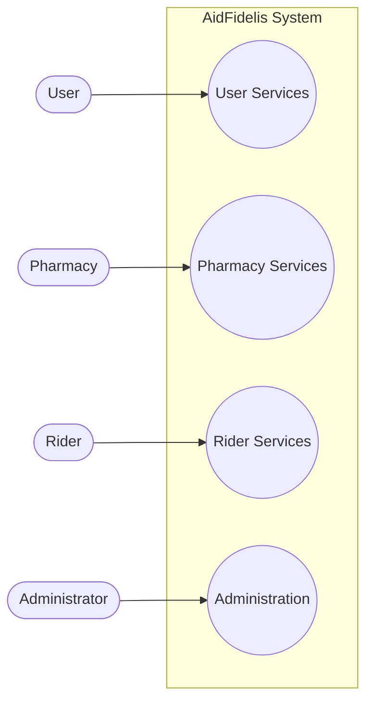
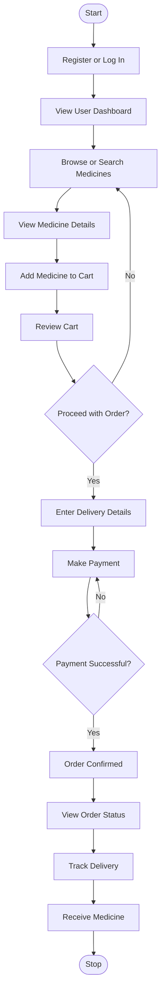
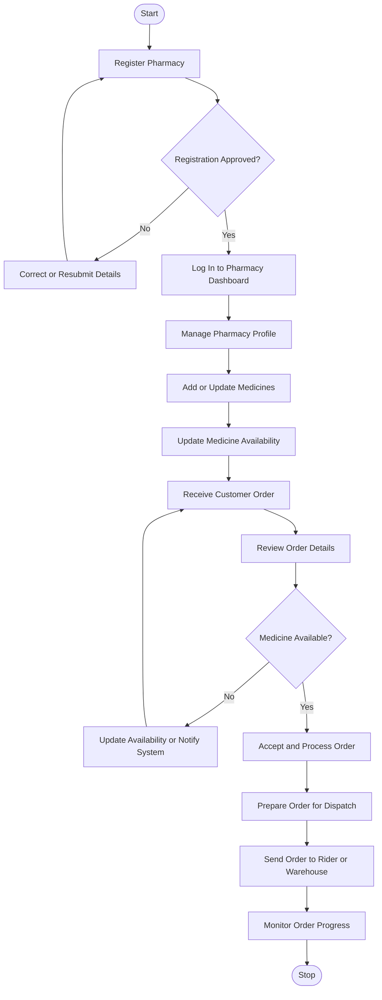
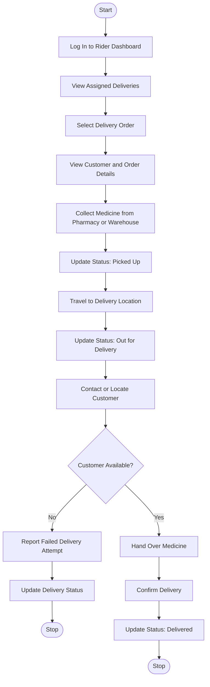
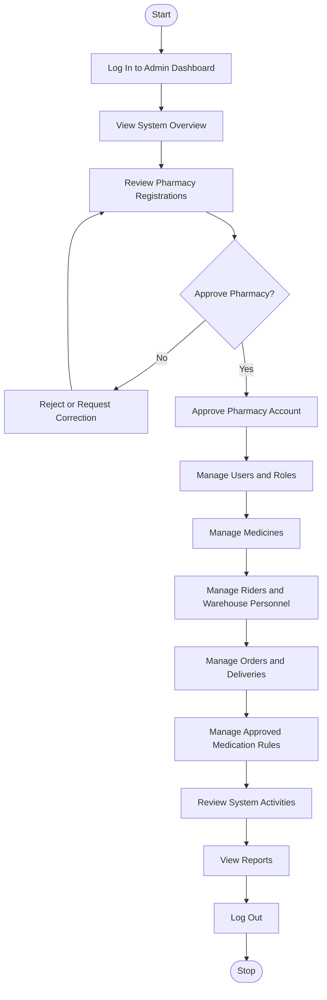

# AidFidelis Use Case Diagrams

## Figure 3.1: Grouped Use Case Diagram

## Figure 3.2: User Use Case Flow

## Figure 3.3: Pharmacy Use Case Flow

## Figure 3.4: Rider Use Case Flow

## Figure 3.5: Administrator Use Case Flow

## Figure Captions

- **Figure 3.1:** Grouped Use Case Diagram of the AidFidelis System
- **Figure 3.2:** User Use Case Flow
- **Figure 3.3:** Pharmacy Use Case Flow
- **Figure 3.4:** Rider Use Case Flow
- **Figure 3.5:** Administrator Use Case Flow

## How to Export the Diagrams

Open this file in a Mermaid-compatible Markdown preview. In Visual Studio Code, install a Mermaid diagram preview extension, open the Markdown preview, and export or capture each diagram for insertion into Microsoft Word. The diagrams can also be recreated in draw.io using the same steps and labels.
